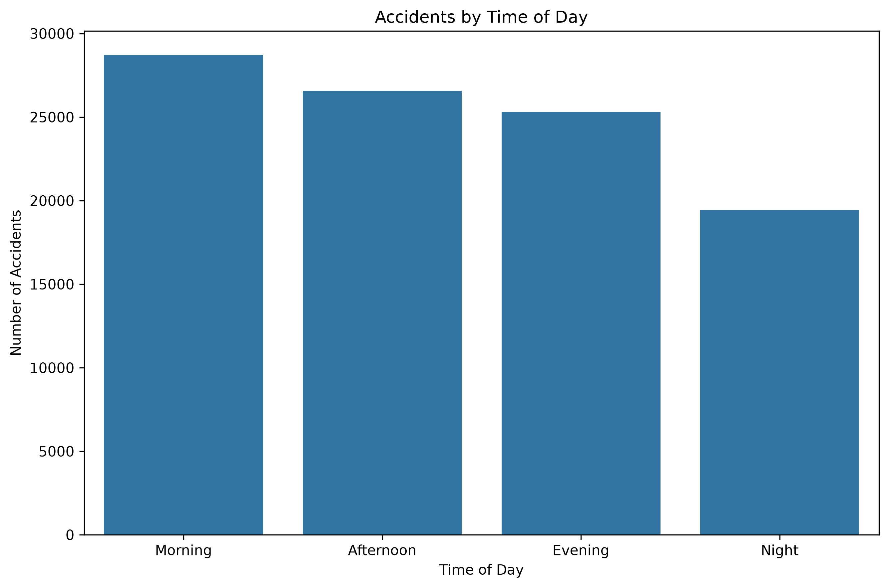
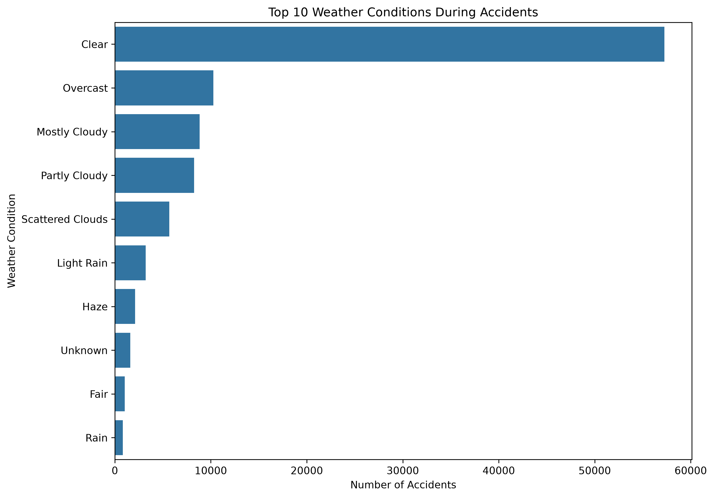
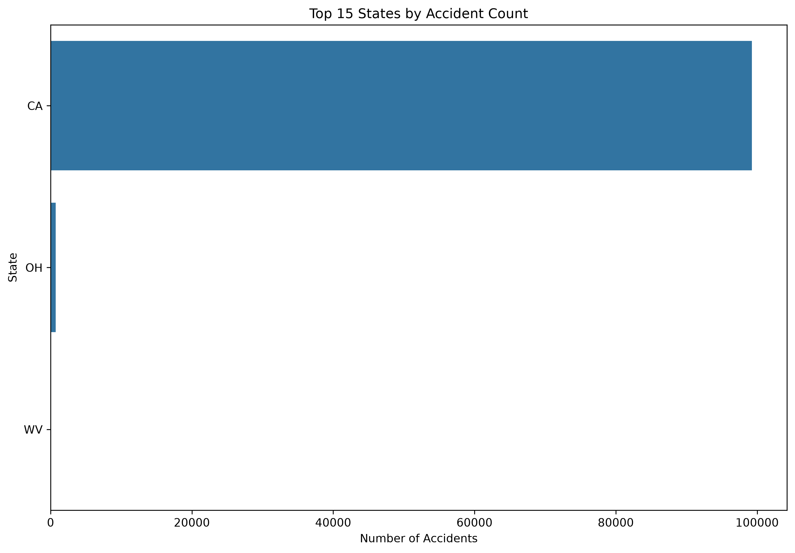
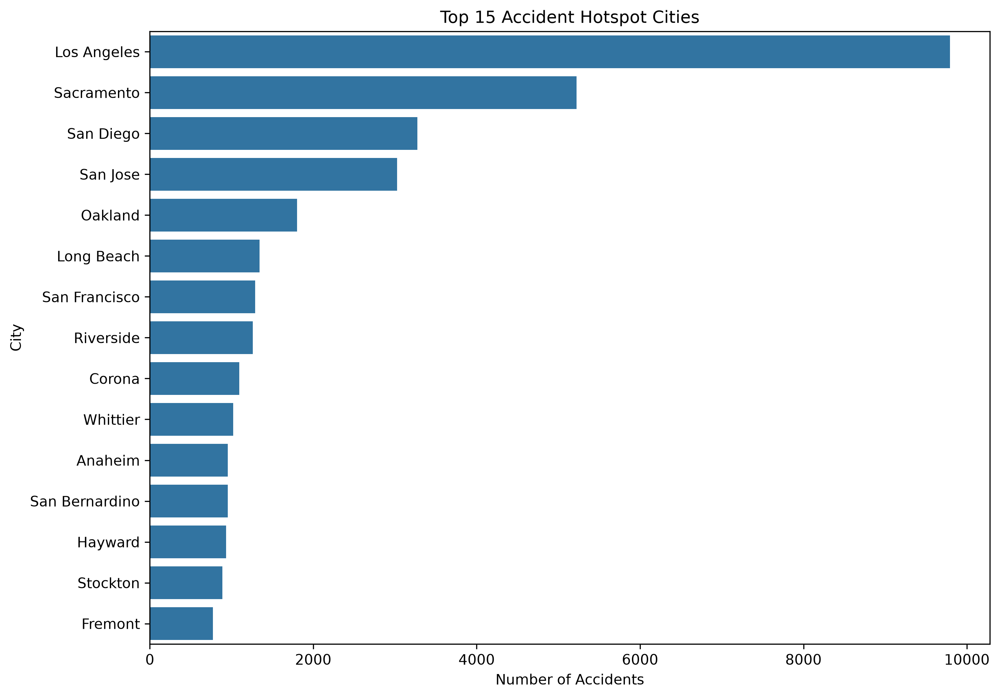
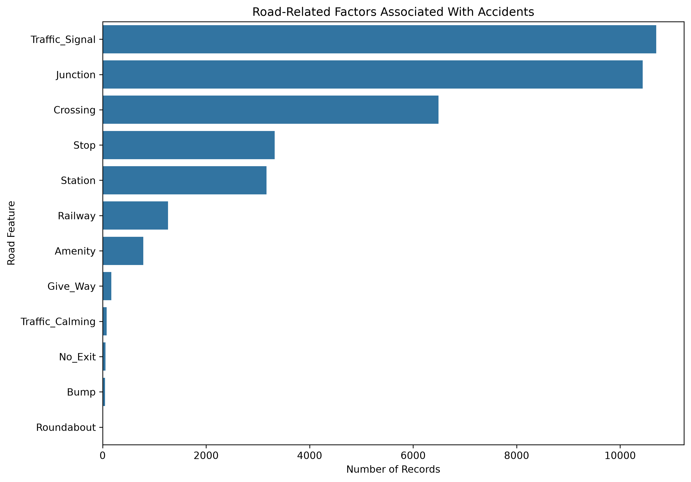
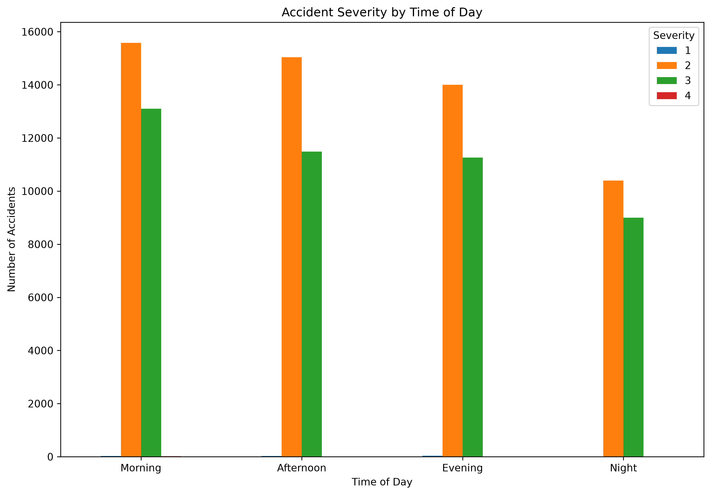
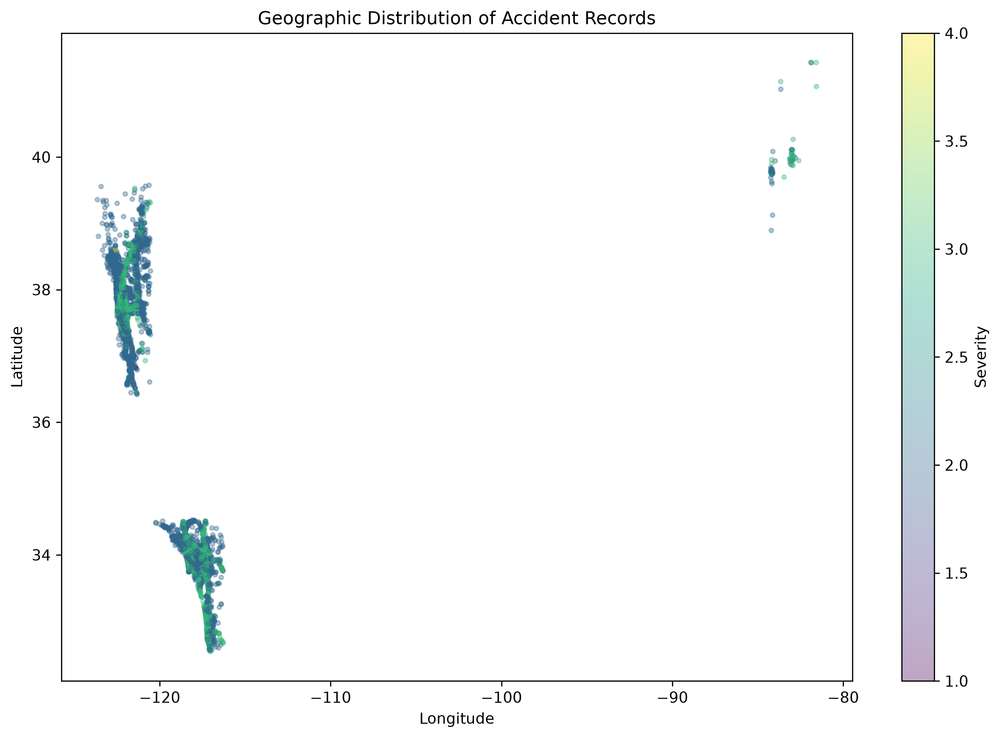

# Task 5 - Traffic Accident Analysis

## Objective

Analyze traffic accident data to identify patterns related to road conditions, weather, time of day, accident severity, and geographical location.

The analysis uses the US Accidents dataset and focuses on identifying accident hotspots and contributing factors through exploratory data analysis and visualization.

## Dataset

Dataset: US Accidents

Source: Kaggle - US Accidents Dataset

The original dataset contains millions of accident records across the United States with information about:

- Accident severity
- Start and end time
- Geographic coordinates
- Distance
- Location
- Weather conditions
- Temperature
- Humidity
- Visibility
- Road features
- Traffic signals
- Junctions
- Crossings
- Other road-related conditions

For this project, a 100,000-record sample was extracted from the official dataset to keep the analysis lightweight and suitable for local execution.

## Technologies Used

- Python
- Pandas
- NumPy
- Matplotlib
- Seaborn

## Analysis Performed

### 1. Accidents by Time of Day

The accident start time was converted into datetime format and categorized into:

- Morning
- Afternoon
- Evening
- Night

This helps identify when accidents occur most frequently.

### 2. Weather Conditions

The analysis identifies the most common weather conditions recorded during accidents.

### 3. State-wise Accident Distribution

Accident records were grouped by state to identify states with the highest number of records in the analyzed sample.

### 4. Accident Hotspots

Cities were analyzed based on accident frequency to identify locations with a high concentration of accident records.

### 5. Road-related Factors

The following road features were analyzed:

- Traffic signals
- Junctions
- Crossings
- Stops
- Stations
- Railways
- Amenities
- Give Way
- Traffic calming
- No Exit
- Bumps
- Roundabouts

### 6. Accident Severity

Accident severity was compared across different times of day to identify patterns between accident timing and severity.

### 7. Geographic Hotspots

Latitude and longitude coordinates were plotted to visualize the geographical distribution of accident records.

## Key Observations

Based on the analyzed 100,000-record sample:

- The sample is strongly concentrated in California because the first 100,000 records from the official dataset were used.
- Los Angeles has the highest number of accident records among the cities in the sample.
- Traffic signals and junctions are among the most frequently recorded road-related features associated with accidents.
- Weather conditions such as Rain appear among the recorded conditions during accidents.
- Accident timing and severity can be compared using the generated time-of-day analysis.

> Note: These observations describe the analyzed sample and should not be interpreted as statistics for the complete US Accidents dataset.

## Visualizations

### Accidents by Time of Day



### Weather Conditions



### Top States



### Accident Hotspots



### Road-related Factors



### Severity by Time of Day



### Geographic Hotspots



## Project Structure

```text
Task-05/
├── README.md
├── create_sample.py
├── task_05.py
├── dataset/
│   └── US_Accidents_sample.csv
└── outputs/
    ├── accidents_by_time_of_day.png
    ├── accidents_by_weather.png
    ├── accident_hotspots.png
    ├── geographic_hotspots.png
    ├── road_factors.png
    ├── severity_by_time.png
    └── top_states.png